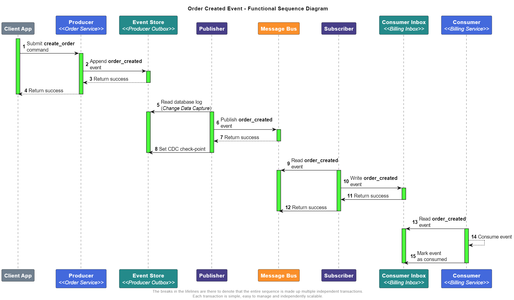

# Loosely coupled pub-sub on Azure

Describe the diagram under "From real-world to abstract"

pitfalls avoid
Mixing the subscriber code with other functionality. Can't scale one without the other.

Outro

Insert diagrams

The [publisher-subscriber pattern](https://learn.microsoft.com/en-us/azure/architecture/patterns/publisher-subscriber) is all about decoupling systems, it originates from a real-world distribution model commonly used to distribute physical media. In this article we are going to explore one way to implement a loosely coupled pub-sub architecture in [Azure](https://azure.microsoft.com/en-us).  We will start our journey by looking at a simple example of how the pub-sub pattern works in the music industry. Then I will translate the real-world example into an abstract sequence diagram. Next, I will put forward several arguments in favor of implementing the pub-sub pattern as a sequence of loosely coupled components. Finally, we'll conclude by exploring a loosely coupled and highly scalable implementation using Azure services.

This article is long and opinionated, if you are already bought in to the idea of loosely coupled pub-sub architectures I suggest you skip down to the technical stuff where I describe why I selected each Azure service.

## Pub-sub in the real world

The production, publication, distribution, wholesale, and consumption of a music album can be summarized as follows:

1. Your favorite artist produces a musical album in a recording studio.
2. The record label manufactures and publishes the album.
3. A distributor ships the album through it's distribution network to retailers.
4. Retailers purchase the album at wholesale from the distributor.
5. Music fan purchase the album from retailers.

Let's examine the role played by each participant in our over simplified music distribution model. The artist is arguably the most important part of this model, they are the catalyst to the whole process. Regardless of how important they may be their active involvement ends shorty after the production of the album. They delegate the manufacture, distribution and sale of the album to other actors of the system. The artist maintains a vested interest in album sales, however they only have an abstract notion of how a copy of the album will find its way to fans. All the intervening steps between production and sale fall outside the artist's purview.

Next we will skip a few steps and move our focus to the fans. Here we find a similar story to the artist in terms of the intervening steps between producing and purchasing the album. The music fan only cares about the enjoying the music. The manufacture, distribution, and wholesale are nothing but technical details to the fans. 

The record label, the distributor, and the retail store could be considered less critical. One could replace any and all of these actors with an equivalent actor and neither the artist nor the fan would notice. However, consider this, why doesn't the artist press their own records, drive the delivery truck, drop off the album at their fan's mailbox and cut out the middle layer? Because that is a lot of work the artist rather not be doing. The record label, the distributor, and the retail store bring value and specialized skills. They bring economies of scale and efficiency, business relationships, industry clout, and physical infrastructure. I want to put a fine point on the importance of the middle layer components because it is a crucial aspect to understanding loosely coupled pub-sub architectures. Do you think the artists wants to deal with payment processing, charge backs, the insurance on a retail space, delivery truck maintenance? Of course not. Artist need to be busy making music, everything else can be handled by those better suited for those jobs. Keep this list of assiduous tasks and responsibilities in mind because we'll revisit them in a bit.

We've taken the music record analogy as far as it can go. Now we will switch to the world of software architecture. We can roughly equate the real world actors to their corresponding abstract components in a pub-sub architecture. The artist in the real world equates to the producer, the record label to the publisher, the distributor to a message bus, the music store to a subscriber and a music fan to a consumer. To ease the transition we will start with some definitions to ensure we have a shared understanding of technical terms. In particular I am going to make a firm distinction between the terms producer and publisher as well as subscribers and consumers. These terms are often used interchangeably in high level system designs but once we get into implementation details the distinction becomes necessary.

## Producers & Publishers
A producer is a business construct responsible for creating domain events based on business rules. Producing events is strictly a business concern, the producer is divorced from all infrastructure related responsibility. Much like the business logic isn't responsible for data persistance which is typically delegated to a database. Producers are not responsible for publishing events, publishing is an infrastructure concern.

A publisher is component from the infrastructure layer responsible for marshaling events from the event store to the message bus. The publisher sets the terms of the integration with subscribers. It owns the message bus and its operational policies. The publisher is a commodity, a technical detail, the publisher should not encompass any business knowledge. The implementation of the publisher is dictated by the operational environment.

### A deeper dive: reasons to separate producers and publishers
#### Separation of concern
Publishing events is a complex endeavour. Publishers must deal with the idiosyncrasies of the message bus, geo-replication, retries, replays, queue & log semantics, partitions, sessions, ordering, deduplication, network partitions, etc. Recall all those assiduous task that the artist does not want to mess with. The same principal of separation of concern applies to the producer. Producers should not be burdened with the technical details of publishing an event. The producer must focus on the production of domain events and nothing else.
#### Eliminate distributed transactions
Without separating the roles of producer and publisher into distinct components the producer must utilize a distributed transaction wherein it must write the event to the event store and publish the event to the message bus simultaneously to maintain consistency. Distributed transaction simply don't work in cloud environments.

By separating the roles the producer need only to emit the domain event, the application and infrastructure layers will marshal the event to the event store in a single transaction. The publisher will eventually read and publish the event in a separate transaction. With this arrangement the producer is free to operate even when there is an outage on the message bus that would otherwise make a distributed transaction impossible.

#### Independent scaling
The scaling profile of the producer may be significantly different than that of the publisher. Consider an application where the producer is a real-time service that accepts customer orders. The producer will need to be scaled in direct relation to customer demand. Accepting the order is critical, however, after an order is accepted the rest of the order fulfillment process may operate at a fixed rate. In this example the publisher may be scaled and configured to provide a fixed throughput. The fixed throughput in turn provides load leveling for the rest of the fulfillment process.

Now consider a scenario were a large number of events need to be republished because the business wants to try new streaming analytics workflow or we need to hydrate the message bus after recovering from a disaster. In such cases the publisher may be scaled out/up temporarily to provide increased throughput without affecting the producer.

#### Independent deployment
As the business evolves so must the producer. The producer will need to be update regularly, specially in the early days of development. On the other hand the publisher is a commodity. The publisher should be blissfully ignorant of business logic and thus should have very little reason to change. Separating the roles allows the producer to be updated and deployed independently from the the publisher.

### High availability, business continuation, and disaster recovery
A loosely coupled pub-sub architecture does not inherently provide high availability, business continuation, and disaster recovery, at least not directly. What it does provide is the flexibility to introduce HA/BC/DR into any and all components of the system in the way that is most appropriate for that component.

## Subscribers & Consumers
A subscriber is a component from the infrastructure layer responsible for marshaling events from the message bus to the consumer of the event. Its purpose is to abstract the message publishing infrastructure from the consumer. You can think of the subscriber as the mirrored counterpart of the publisher. Just like the publisher, the subscriber is a commodity, a technical detail and it also should not encompass any business logic. Its implementation is dictated by the infrastructure.

    In some architectural literature you may find publishers and subscribers collectively referred to as message relays. I would urge you to use the terms publisher and subscribers if for no other reason than these terms invoke a mental model that is more contextual. In other words the terms publisher and subscriber immediately let you know which side of the pub-sub architecture you are working with.

A consumer is a business construct responsible for reacting to a domain event. Consuming events is a business concern and so the behavior of the consumer is dictated by business rules. In the same way that the subscriber is the mirrored counterpart of the publisher so is the consumer the mirror counterpart of the producer.

### Reason to separate subscribers and consumers
In the interest of brevity I will summarize the reasons to separate subscribers and consumers as roughly the same reasons given for separating the producers and publishers. There are some differences of course but the principals are largely the same.

#From real-world to abstract

## From abstract to concrete
Now it's time to move into an implementation plan. I will break down each component from the functional sequence diagram. Considering the subject of this article is loosely coupled pub-sub I will skim over the intricacies of many of the components to focus on pub-sub constructs. It goes without saying that the implementation I am presenting is simply an illustrative example, one of many possible solutions and your solution will likely vary.

### Client App
The client application is the first component in the functional sequence diagram but the only reason it is present on the diagram is to illustrate the end-to-end system flow. The client app is one of the components we will ignore because its role is inconsequential to the pub-sub architecture.
### Order Service <i><<Producer\>\></i>
The order service is the first actor in the pub-sub architecture. As the producer the order service is responsible for creating the order_created event as required by business rules. Notice its active role within the complete workflow is rather short-lived. In terms of a loosely coupled pub-sub architecture hosted on Azure it can be implemented using any of the [compute solutions on offer](https://learn.microsoft.com/en-us/azure/architecture/guide/technology-choices/compute-decision-tree).  

### Event Store <i><<Cosmos DB\>\></i>
Using [Cosmos DB](https://azure.microsoft.com/en-us/products/cosmos-db/) as an event store is a practical choice for a few reasons. From the perspective of the producer it is a world-class, high-performance, fully managed and serverless distributed database, what more could you want? For the perspective of the publisher Cosmos DB offers one key feature, the built-in [change feed](https://learn.microsoft.com/en-us/azure/cosmos-db/change-feed). The change feed offers an in-order, durable, lifetime stream of the events. 

    The producer can also take advantage of the change feed by using the change feed to develop materialized views in CQRS and event driven architectures.

### Publisher <i><<Azure Functions\>\></i>
With Cosmos DB as our event store the most convenient way to implement a publisher is using [Azure Functions](https://azure.microsoft.com/en-us/products/functions). Azure Functions offers an [input binding](https://learn.microsoft.com/en-us/azure/azure-functions/functions-bindings-cosmosdb-v2?tabs=in-process%2Cfunctionsv2&pivots=programming-language-csharp) specifically designed for reading the Cosmos DB change feed. If the message bus that we are targeting is one of the many supported output bindings then the amount infrastructure plumbing code is reduced to near zero. The change feed input binding handles scaling, parallel processing and check-pointing. The output binding handles retries for popular message bus solutions like Event Hubs and Service Bus.

Azure Functions is just one many compute platforms available. The publisher may be implemented with just about any compute solution thanks to the many [change feed processors](https://learn.microsoft.com/en-us/azure/cosmos-db/nosql/change-feed-processor?tabs=dotnet) SDKs. 

## Alternatives publishing patterns
There are two other loosely coupled publishing patterns I want to touch on before we move on to the subscription side of the pub-sub equation, entity-first and [transactional outbox](https://microservices.io/patterns/data/transactional-outbox.html). Entity-first is focused on integrating non-event-driven applications into an event-driven architecture. Transactional outbox is somewhat of a hybrid implementation of entity-first and event-driven apps.

### Entity-first event publishing
It is common to find business critical application that operate directly on the state of a business entity. In other words, these are not natively event-driven applications. These application have no concept of a domain event, only the latest entity state is ever persisted. It is not uncommon to have to integrate these applications into an event driven architecture. In fact I suspect the need to integrate these system is very commonplace in any organization that has been around for more than a few years. Modifying these applications to publish events is typically not practical. An common approach is to implement an adapter component that reads the database log and publishes events to a message bus. The following rudimentary sequence diagram illustrates the broad strokes.

(Insert picture of entity sequence diagram here)

The key step to note is step #6 "Derive orderCreated event based on order table insert". It may seem that the publisher is doing the producer's job by creating the event but I will argue that the event was logically created at the order service when it executed the business rules to affect the state changes on the business entity. I would further argue that the publishing is merely translated the logical domain event from the database log to an event object. The publisher still remains ignorant to the business rules.

### Transactional outbox
In the most academic sense the producer in an event-driven application does not need to maintain entity state, the state can always be derived from the event stream. In reality there is almost always a need to maintain some sort of read model and in some cases the entity state can server as a general purpose read model. The transactional outbox pattern allows us to kill two birds with one stone while also avoiding distributed transactions.

The transactional outbox pattern is not without trade offs. Applying [this pattern with Cosmos DB](https://learn.microsoft.com/en-us/azure/architecture/best-practices/transactional-outbox-cosmos) has its own challenges. The entity state and the events must reside in the same container. This means that entity state and events share a few physical resources namely storage, RU's, backups, partition keys and operational concerns like read/write permissions, maintenance windows, and monitoring.

### Message Bus <i><<Service Bus or Event Hubs\>\></i>
There are a million descriptions of the message bus on the internet and just as many products and managed services in the market to fit all needs and so we will not labor the subject. For a comparison of the services offered on Azure see: [Choose between Azure messaging services - Event Grid, Event Hubs, and Service Bus](https://learn.microsoft.com/en-us/azure/service-bus-messaging/compare-messaging-services). All the first party messaging services offered on Azure have an excellent track record. Choose which ever is most appropriate for your application.

### Subscriber <i><<Azure Functions\>\></i>
Azure Functions offers input bindings for [Event Hubs](https://learn.microsoft.com/en-us/azure/azure-functions/functions-bindings-event-hubs-trigger?tabs=python-v2%2Cin-process%2Cfunctionsv2%2Cextensionv5&pivots=programming-language-csharp) and [Service Bus](https://learn.microsoft.com/en-us/azure/azure-functions/functions-bindings-service-bus-trigger?tabs=python-v2%2Cin-process%2Cextensionv5&pivots=programming-language-csharp). These triggers make it easy to implement a subscriber. The triggers require little to no custom code and they abstract away the intricacies of the Event Hub and Service Bus. The functions run-time along with the input trigger scale functions to match the message bus solutions. The triggers maintain check-pointing as necessary. With the right output binding we can keep the infrastructure plumbing code to a bare minimum.

### Inbox
Which data storage service we choose for the inbox is going to depend on the characteristics of the consumer. How sensitive is the consumer to latency? Is the consumer scalable? Does the consumer support idempotency? The list of factors to consider can be extensive but typically one or two factors drive the decision. 

Assuming the consumer is a latency tolerant event-driven application we may choose to employ another instance of a message bus. Alternatively the consumer may be a latency sensitive application, perhaps something like the leader board for a multi-player game; we may forgo the inbox altogether in that case. Imagine the consumer is a legacy application that operates from CSV batch files, here the inbox may simply be a file on Azure Blob Storage. Ultimately the choice of subscriber and inbox must be made in terms of the consumer.

    It maybe be tempting to use Cosmos DB as an inbox for an event-driven consumer. After all the change feed provides an in-order, durable, lifetime stream of the events. Pair that with the change feed processor on the consumer and you have a rudimentary log-based message bus (ie: Event Hubs, Kafka) but I would advice against it. Using Cosmos DB or any other database as an inbox means you loose out on the messaging semantics of a purpose built message bus. 

    For example databases typically lack support for the following messaging constructs.
    * Competing consumer processing - eg: server managed locks like those provided by Service Bus
    * Fan out distribution
    * Built-in dead letter queue
    * Maximum delivery count
    * Session state
    * Check-pointing
    * Native messaging observability metrics - eg: number of messages in queue, messages per second
    * Native messaging insights and operation semantics - eg: Application Insights, Azure Advisor, Azure Policy.
    * Native platform events and integration - eg: native integration with Event Grid, Azure Functions, and SDKs.    

## Principals of loosely coupled pub-sub architectures
If you take anything away from this article let it be these principals.
* Producers and consumers are business concerns. They change as the business dictates.
* Publishers, subscribers, and the message bus are infrastructure components. They are a technical detail.
* Producers must not be aware of consumers. 
* Producers must not be aware of their supporting publisher.
* Consumers must not be aware of their supporting subscriber.
* Consumers must only be aware of the events they consume.
* A consumer must be agnostic to the producer of an event.
* Publishers must have an abstract notion of subscribers. The publisher should maintain a certain level of stability in the message bus for its subscribers but should not be actually aware of any particular subscriber.

	
	

# Scrap yard
 Publisher must collaborate with subscribers to the degree that enables the subscribers to read events from the message bus but no further.

For systems that demand the highest level of availability each component can be configured in an active-active topology. Systems with lower availability requirements may be configured in an active-pilotlight topology where only the datastore is replicated.

Working with legacy and heterogenous technology is a staple of the technologist's skill set

Regular folks like you and I do not need to know how the album arrived at the music store. The only thing that matters from the consumers perspective is that our favorite artist produced a great album and that there is a convenient way to purchase the album

The pub-sub pattern in software development is directly based on the real world pub-sub pattern of the media industry. I like to use the analogy of a music record producer and a publishing house when I think about the pub-sub pattern in my software designs. In the music industry the producer is concern with making a good record that the audience (consumers) will like. The producer is not concern with record stampings, packing, shipping, marketing, etc... that's the publishers job. I think of events as making the music, the art, the unique atom of work that delivers value. I think of publishing as the labor of moving physical objects from point A to point B. As a record label (ie: the business) I want my producer cranking out as many hits as possible. Publishing is nothing more than a commodity farmed out to the lowest bidder.

The artist (ie: the producer) and the fans (ie: consumers) are the key players in this model. One cannot easily swap the artist or the fans without a major shake up. 