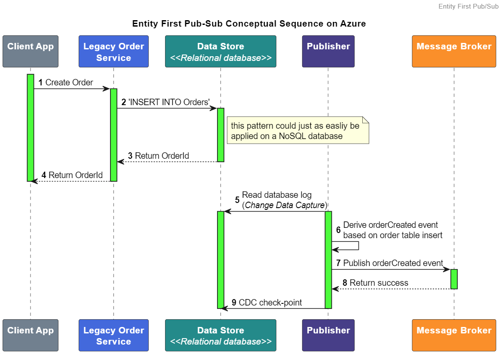
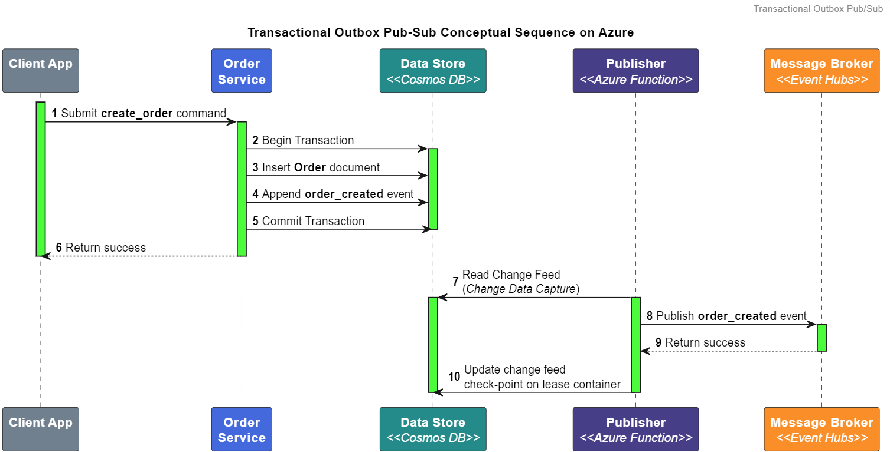

# Loosely coupled pub-sub on Azure
The [publisher-subscriber pattern](https://learn.microsoft.com/en-us/azure/architecture/patterns/publisher-subscriber) is all about decoupling systems. This article focuses on evangelizing the principals and benefits of loosely coupled pub-sub architectures and less so on the technical details. We progress from abstract principals to a high level implementation using [Azure](https://azure.microsoft.com/en-us) resources to demonstrate that the principals can be implemented easily. We are not just talking theory here. Our journey will begin by examining a simple example of how the pub-sub pattern functioned in the music industry before digital streaming became the norm. After all, the pub-sub pattern originates from a real-world model used to distribute physical media. Then we will translate the real-world example into an abstract sequence diagram. Lastly we will explore an implementation using Azure resources.

## Pub-sub in the real world

I admit that an example based around physical media distribution is a little dated but it works well to illustrate the pattern so I am sticking with it.

The production, publication, distribution, wholesale, and consumption of a music album can be summarized as follows:
1. Your favorite artist produces a musical album inside a recording studio.
2. The record label manufactures and publishes the album.
3. A distributor ships the album through it's network to retailers.
4. Retailers purchase the album at wholesale from the distributor.
5. Music fans purchase the album from retailers.

Let's examine the role played by each participant in our admittedly over simplified distribution model. The artist is arguably the most important part of this model, they are the catalyst. However their active involvement ends shorty after the production of the album. They delegate the manufacture, distribution and sale of the album to other actors of the system. While the artist maintains a vested interest in album sales they are disconnected from the details of how the album will find its way to fans. All the intervening steps between production and sale fall outside the artist's purview.

The middle layer, that is, the actors between the artist and the fans are fungible service providers. Meaning, one could replace the record label, the distributor, and the retail store with an equivalent providers and neither the artist nor the fan would notice. Fungible as they are they are still key to the pub-sub model. Consider this, why doesn't the artist press their own records, drive the delivery truck, drop off the album at their fan's mailbox and cut out the middle layer? Because that is a lot of work the artist rather not be doing. The service providers bring their own unique value to the process. They bring economies of scale and efficiency, business relationships, industry clout, and physical infrastructure. I want to put a fine point on the importance of the middle layer providers because it is a crucial aspect to understanding loosely coupled pub-sub architectures. The artist does not want to deal with the drudgery of manufacturing, distribution and retail sales. Artist should do what they do best, make music, everything else can be handled by those better suited for those tasks. Keep this list of assiduous tasks in mind because we'll revisit them in a bit.

From the fan's perspective we find a similar story to the artist in terms of the middle steps between production and consumption. The music fan only cares about enjoying the music. The manufacture, distribution, and wholesale are nothing but logistical details to the fan.

The music record analogy has gone as far as it can go. It is time to switch to the world of software architecture. For every real world actor and service provider there is a correspond component in the pub-sub pattern. The artist in the real world equates to the producer, the record label to the publisher, the distributor to a message bus, the music store to a subscriber and a music fan to a consumer.

The terms producer and publisher, subscriber and consumer are often used interchangeably when discussing the pub-sub pattern. Which terms you typically use depend on which message bus product you are most familiar with. These are distinct components with separate roles and responsibilities. The distinction between these components is essential to describing and implementing a loosely coupling pub-sub architecture.

## Producers & Publishers
A producer is a business construct responsible for creating domain events based on business rules. Producing events is strictly a business concern, the producer is divorced from all infrastructure related responsibility. Much like the business logic isn't responsible for data persistance which is typically delegated to a database. Producers are not responsible for sending events to the message bus, publishing is an infrastructure concern.

A publisher is component from the infrastructure layer responsible for marshaling events from the event store to the message bus. The publisher sets the terms of the integration with subscribers. It owns the message bus and its operational policies. The publisher is a service provider, a technical detail of the messaging infrastructure. The publisher should not encompass any business knowledge. The implementation of the publisher is dictated by the operational environment.

### A deeper dive: reasons to separate producers and publishers
#### Separation of concern
Publishing events is a complex endeavour. Publishers must deal with the idiosyncrasies of the message bus, geo-replication, retries, replays, queue & log semantics, partitions, sessions, event ordering, deduplication, network partitions, etc. Recall all those assiduous task that the artist does not want to deal with; the producers should not be burdened with the technical details of publishing an event. The producer must focus on the production of domain events.
#### Eliminate distributed transactions
Without separating the roles of producer and publisher the producer must utilize a distributed transaction wherein it must write the event to the event store and publish the event to the message bus simultaneously to maintain consistency. Distributed transaction simply don't work in cloud environments.

By separating the roles the producer can produce and persist the event to the event store in one transaction. The publisher may then read and publish the event in a separate transaction. With this arrangement the producer is free to operate even when there is an outage on the messaging infrastructure that would otherwise make a distributed transaction impossible.

#### Independent scaling
The scaling profile of the producer may be significantly different than that of the publisher. Consider an application where the producer is a real-time service that accepts customer orders. Accepting the orders is critical and the producer will need to be scaled in direct proportion to customer demand. After an order is accepted the rest of the order fulfillment process may operate at a slower rate. The publisher may be scaled and configured to provide a fixed throughput regardless of the rate of incoming orders. A fixed throughput in turn enables load leveling for the fulfillment process.

Now consider a scenario were a large number of events need to be republished due to an outage on the message bus. In such cases the publisher may be scaled up temporarily to provide increased throughput without affecting the producer.

#### Independent deployment
The producer will need to be update regularly, specially in the early days of development. On the other hand the publisher is a commodity. The publisher should be blissfully ignorant of business logic and thus should have very little reason to change. Separating the roles allows the producer to be updated and deployed independently from the the publisher.

### High availability, business continuity, and disaster recovery
A loosely coupled pub-sub architecture does not inherently provide high availability (HA), business continuity (BC), and disaster recovery(DR) capabilities. At least not directly. What it does provide is the flexibility to introduce HA/BC/DR into any component in the way that is most appropriate for that component.

## Subscribers & Consumers
A subscriber is a component from the infrastructure layer responsible for marshaling events from the message bus to the consumer of the event. Its purpose is to abstract the messaging infrastructure from the consumer. You can think of the subscriber as the mirrored counterpart of the publisher. Just like the publisher, the subscriber is a commodity, a technical detail and it also should not encompass any business logic. Its implementation is dictated by the infrastructure.

    In some architectural literature you may find publishers and subscribers collectively referred to as message relays. I would urge you to use the terms publisher and subscribers if for no other reason than these terms invoke a mental model that is more congruent. In other words the terms publisher and subscriber immediately let you know which side of the pub-sub architecture you are working with.

A consumer is a business construct responsible for reacting to a domain event. Consuming events is a business concern and so the behavior of the consumer is dictated by business rules. In the same way that the subscriber is the mirrored counterpart of the publisher so is the consumer the mirror counterpart of the producer.

### Reason to separate subscribers and consumers
In the interest of brevity I will characterize the reasons to separate subscribers and consumers as roughly the same reasons given for separating the producers and publishers. There are some differences of course, but the principals are largely the same.

##An abstract example
So far we have established a mental model of what pub-sub looks like in the real world and clear definitions of the abstract components. Next we will explore a functional sequence diagram to illustrate the interactions between the components. The example is based on the quintessential "order created" exercise that is typically used when describing event-driven architectures. I chose a sequence diagram in particular because I wanted to emphasize the temporal loose coupling. The lifelines in the diagram are highlighted to demonstrate when each component is active.

There are other key aspects to note. The end-to-end asynchronous sequence is made up of multiple smaller synchronous sequences. The synchronous sequences are made up of no more than three components. Using short and simple sequences has many benefits. Each sequence is easy to reason about. Each component only has to be communicate with at most two other components. Each component may be scaled within the context of a short sequence. The need for distributed transactions is eliminated. Outages and transient faults become easier to handle.

## From abstract to concrete
Now it's time to move into an implementation plan. We will touch on each component from the functional sequence diagram. Considering the focus of this article is the principals behind loosely coupled pub-sub I will skim over the intricacies of some of the components to focus on the pub-sub pattern. It goes without saying that the implementation I am presenting is simply an illustrative example, one of many possible solutions. Your solution will likely vary.

### Client Application
While the client application is the first component in the diagram it is also the least relevant to the pub-sub pattern. It is depicted in the diagram for completeness' sakes so we will skip it. 
### Order Service <i><<Producer\>\></i>
The order service is the first actor relevant to the pub-sub pattern. As the producer the order service is responsible for producing the order_created event based on business rules. In terms of a loosely coupled pub-sub architecture hosted on Azure it can be implemented using any of the [compute solutions offered on Azure](https://learn.microsoft.com/en-us/azure/architecture/guide/technology-choices/compute-decision-tree).  

### Event Store <i><<Cosmos DB\>\></i>
[Cosmos DB](https://azure.microsoft.com/en-us/products/cosmos-db/) is a pragmatic choice for the event store. From the perspective of the producer it is a world-class, high-performance, fully managed and serverless distributed database. What more could you want? For the perspective of the publisher Cosmos DB offers one key feature, the built-in [change feed](https://learn.microsoft.com/en-us/azure/cosmos-db/change-feed). The change feed offers a reliable, in-order, durable, lifetime stream of the events that the publisher can easily read and reread as necessary.

    The producer can also take advantage of the change feed by using the change feed to develop materialized views in CQRS and event driven architectures.

### Publisher <i><<Azure Functions\>\></i>
With Cosmos DB as our event store the most convenient way to implement a publisher is using [Azure Functions](https://azure.microsoft.com/en-us/products/functions). Azure Functions offers an [input binding](https://learn.microsoft.com/en-us/azure/azure-functions/functions-bindings-cosmosdb-v2?tabs=in-process%2Cfunctionsv2&pivots=programming-language-csharp) specifically designed for reading the Cosmos DB change feed. The change feed input binding handles scaling, parallel processing and check-pointing. If the message bus you selected is one of the many supported output bindings then the amount infrastructure plumbing code is reduced to near zero.  The output binding handles retries for popular message bus solutions like Event Hubs and Service Bus.

Azure Functions is just one many compute platforms available. The publisher may be implemented with just about any compute solution thanks to the many [change feed processors](https://learn.microsoft.com/en-us/azure/cosmos-db/nosql/change-feed-processor?tabs=dotnet) SDKs.

## Alternative publishing patterns
There are two other loosely coupled publishing patterns I want to touch on before we move on to the subscription side of the pub-sub equation. They are entity-first and [transactional outbox](https://microservices.io/patterns/data/transactional-outbox.html). Entity-first is focused on integrating applications that are not event-driven into event-driven architectures. Transactional outbox is somewhat of a hybrid implementation of entity-first and event-driven apps.

### Entity-first event publishing
It is common to find business critical application that operate directly on the state of a business entity. In other words, these are not natively event-driven applications. These application have no concept of a domain event, only the latest entity state is ever persisted. It is not uncommon to have to integrate these applications into an event-driven architecture. In fact I suspect the need to integrate these system is commonplace in any organization that has been around for more than a few years. Modifying these applications to publish events is typically not practical. A common approach is to implement an adapter component that reads the database log and publishes events to a message bus. The following is a rudimentary sequence diagram that illustrates key points.

The key step to note is step #6 "Derive orderCreated event based on order table insert". It may seem that the publisher is doing the producer's job by creating the event. I will argue that the event was logically created at the order service when it executed the business rules to affect a state change on the business entity. I would further assert that the publisher is merely translating the database log into a domain event. The publisher remains ignorant to the business rules.

### Transactional outbox
From an academic perspective the producer in an event-driven application does not need to maintain entity state because the state can always be derived from the event stream. In practice there is almost always a need to maintain some sort of read model. If we maintain the entity state along with the event stream the entity state can server as a general purpose read model. The [transactional outbox pattern](https://learn.microsoft.com/en-us/azure/architecture/best-practices/transactional-outbox-cosmos) allows us to accomplish both while avoiding a distributed transaction.

The transactional outbox pattern is not without trade offs and applying this pattern with Cosmos DB presents its own challenges. The entity state and the events must reside in the same container. This means that entity state and events share a few physical resources namely storage, resource units (RU's), and partition keys. Then there are the operational concerns like read/write permissions, maintenance windows, backups, and monitoring. The transactional outbox pattern can also be implemented using other database products that support a certain type of ACID transaction but the resource sharing concerns remain regardless of the database.

### Message Bus <i><<Service Bus or Event Hubs\>\></i>
There are a million and one descriptions of the message bus concept on the internet and just as many products and managed services in the market to fit all needs, so we will not labor the subject. For a comparison of the services offered on Azure see: [Choose between Azure messaging services - Event Grid, Event Hubs, and Service Bus](https://learn.microsoft.com/en-us/azure/service-bus-messaging/compare-messaging-services). All the first party messaging services offered on Azure have an excellent track record. Choose which ever is most appropriate for your application.

### Subscriber <i><<Azure Functions\>\></i>
Azure Functions offers input bindings for [Event Hubs](https://learn.microsoft.com/en-us/azure/azure-functions/functions-bindings-event-hubs-trigger?tabs=python-v2%2Cin-process%2Cfunctionsv2%2Cextensionv5&pivots=programming-language-csharp) and [Service Bus](https://learn.microsoft.com/en-us/azure/azure-functions/functions-bindings-service-bus-trigger?tabs=python-v2%2Cin-process%2Cextensionv5&pivots=programming-language-csharp). These bindings require little to no custom code and they abstract away the intricacies of the Event Hub and Service Bus. The Azure Functions run-time will scale the function to match the message bus content and the bindings maintain check-pointing as necessary. With the right output binding we can keep the infrastructure plumbing code to a bare minimum.

### Inbox
Which data storage service we choose for the inbox is going to depend on the characteristics of the consumer. How sensitive is the consumer to latency? Is the consumer scalable? Does the consumer support idempotency? The list of factors to consider can be extensive but typically one or two factors drive the decision. 

If the consumer is tolerant to latency we may choose to employ another message bus as the inbox. Alternatively the consumer may be highly sensitive to latency, perhaps something like the leader board for a multi-player game, in which case we may forgo the inbox altogether. Imagine the consumer is a legacy application that operates from batch files, here the inbox may simply be a blob on Azure Blob Storage. Ultimately the choice of subscriber and inbox must be made in terms of the consumer.

    It maybe be tempting to use Cosmos DB in lieu of a message bus for an event-driven consumer. After all the change feed provides an in-order, durable, lifetime stream of the events. Pair that with a change feed processor on the consumer and you have a rudimentary log-based message bus (ie: Event Hubs, Kafka) but I would advice against it. Using Cosmos DB as an inbox means you loose out on the messaging semantics that are native to a message bus. 

    For example databases typically lack support for the following messaging constructs.
    * Competing consumer processing - eg: server managed locks like those provided by Service Bus
    * Fan out distribution
    * Built-in dead letter queue
    * Maximum delivery count
    * Session state
    * Check-pointing
    * Telemetry metrics that are relevant to messaging.
    * Native messaging operational semantics - eg: Azure Advisor, Azure Policy.
    * Native platform events and integration - eg: native integration with Event Grid, Azure Functions, and supporting SDKs.

### Billing Service <i><<Consumer\>\></i>
The billing service is one of possibly many consumers of the order_created event. Event consumers may be implemented with just about any compute solution that meets your requirements. There are [many to choose from on Azure](https://learn.microsoft.com/en-us/azure/architecture/guide/technology-choices/compute-decision-tree).

##Wrapping up
Not every application requires a distributed loosely coupled pub-sub architecture. In monoliths and small applications the roles of the pub-sub pattern may be consolidated into just one or a few components. However, the roles of producer and publisher, subscriber and consumer should be maintained logically distinct. I would urge to maintain the roles separated as you design and implement your code even if the roles will ultimately operate withing a single executable. The separation of concern will allow you to easily decompose your application when scaling and distributing becomes necessary.

Loose coupling is just one facet of pub sub. There are many more, too many to explore in one article. Each facet may be more or less applicable to the requirements set before you. Always research best practices before implementing any pattern. 

And finally, if you take anything away from this article let it be these principals.
* Producers and consumers are business concerns. They change as the business dictates.
* Publishers, subscribers, and the message bus are infrastructure components. They are a technical detail.
* Producers must not be aware of consumers. 
* Producers must not be aware of their supporting publisher.
* Consumers must not be aware of their supporting subscriber.
* Consumers must only be aware of the events they consume.
* A consumer must be agnostic to the producer of an event.
* Publishers must have an abstract notion of subscribers but should not be aware of any particular subscriber in order to maintaining stability in the messaging infrastructure.
